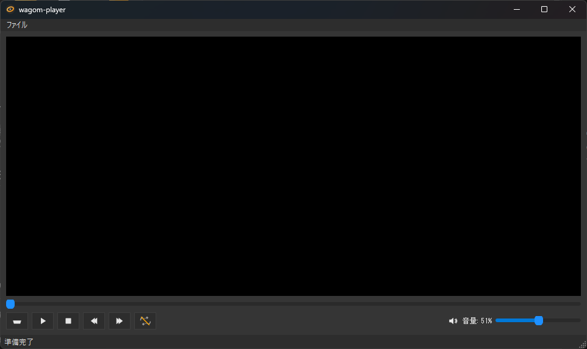

# wagom-player



**キーボード操作と動画選別に特化した、広告のないシンプルなWindows向け動画プレーヤー**

`wagom-player`は、GOM PLAYERの操作感を継承しつつ、大量の動画を効率的に視聴・整理したい用途で自分用に作りました。PyQt5とpython-vlcをベースにした軽量な動作が特徴で、実装は自分がよく使うものだけに絞り、キーボードだけでほとんどの操作が完結するよう設計されています。

## 主な特徴

-   ✨ **広告ゼロ、完全無料**: 視聴を妨げるものは何もありません。
-   ⌨️ **強力なキーボード操作**: 再生、シーク、音量調整からファイル移動まで、マウスは不要です。
-   📂 **高速な動画選別機能**: 再生中の動画をワンキーで`_ok` / `_ng`フォルダに移動。動画の整理・選別作業が劇的に捗ります。
-   🚀 **軽量・シンプル**: 必要最小限の機能で、素早く起動し快適に動作します。

## ショートカットキー一覧

このプレーヤーの操作は、ほぼすべてキーボードで行えますが、スライダーはドラッグに追従します。

| キー (Key) | 機能 (Function) |
| :--- | :--- |
| **再生コントロール** | |
| `Space` | 再生 / 一時停止 (Play / Pause) |
| `→` / `←` | 10秒 シーク (Seek 10 seconds) |
| `テンキー 4` / `テンキー 1` | 60秒 シーク (Seek 60 seconds) |
| `PageDown` / `PageUp` | 次の動画 / 前の動画 (Next / Previous Video) |
| `R` | リピート再生 ON/OFF (Toggle Repeat) |
| `S` | シャッフル再生 ON/OFF (Toggle Shuffle) |
| **動画の選別** | |
| `テンキー 9` | 現在の動画を `_ok` フォルダへ移動し、次を再生 |
| `テンキー 7` | 現在の動画を `_ng` フォルダへ移動し、次を再生 |
| **音量** | |
| `↑` / `↓` | 音量 UP / DOWN (Volume Up / Down) |
| `M` | ミュート ON/OFF (Toggle Mute) |
| **ウィンドウ操作** | |
| `I` | メタデータ情報の表示 |
| `テンキー 0` | ウィンドウの最大化 (Maximize Window) |
| `テンキー 8` | アプリケーションを終了 (Exit Application) |

## 必要要件

-   Python 3.9+
-   VLC 本体（64bit版を推奨）
    -   [公式サイト](https://www.videolan.org/)からVLCをインストールしてください。通常はこれだけで動作します。
    -   VLCが検出されない場合は、環境変数 `PYTHON_VLC_LIB_PATH` に `libvlc.dll` があるディレクトリ（例: `C:\Program Files\VideoLAN\VLC`）を設定してください。

## セットアップ

```bash
# 仮想環境の作成と有効化
python -m venv .venv
.venv\Scripts\activate

# 必要なライブラリのインストール
pip install -r requirements.txt
```

## 使い方

### 実行可能ファイルの場合
- `scripts/build_windows.bat` を実行
- `dist/wagom-player` に実行可能ファイルと`_internal`フォルダができるので、両方 `C:\Program Files\wagom-player` にコピー
- `windows/file-associations.reg` を実行
- winキー押して「既定のアプリ」と検索して開く
- 下の「アプリケーションの規定値を設定する」の検索窓のほうでwagomと検索
- wagom-playerを選択して各拡張子をwagomに規定値を手動で設定（windows8以降、マルウェア対策で自動設定できなくなってるらしい）
- あとvlcが対応してるフォーマットなら対応してるので必要に応じて既定のアプリ設定

### コマンドラインからの場合
```bash
python app.py "C:\path\to\video1.mp4"
```
## ビルド方法
```
pyinstaller -y wagom-player.spec
```

## ライセンス
MIT.