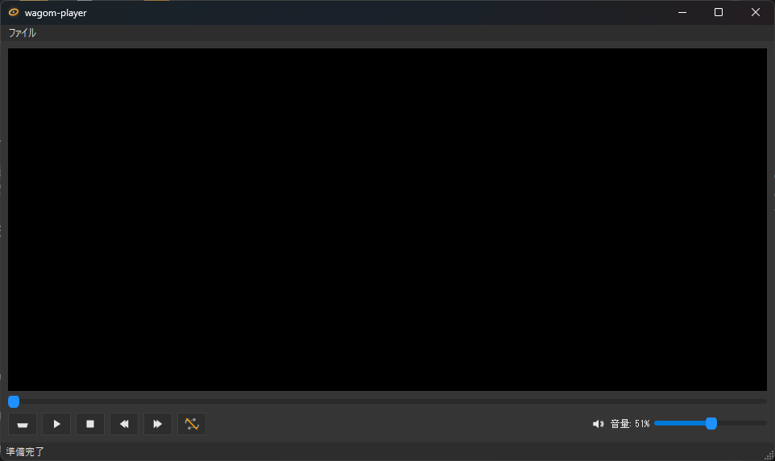

# wagom-player



**キーボード操作と動画選別に特化した、広告のないシンプルなWindows向け動画プレーヤー**

`wagom-player`は、GOM PLAYERの操作感を継承しつつ、大量の動画を効率的に視聴・整理したい用途で自分用に作りました。PyQt5とpython-vlcをベースにした軽量な動作が特徴で、実装は自分がよく使うものだけに絞り、キーボードだけでほとんどの操作が完結するよう設計されています。

## 主な特徴

-   ✨ **広告ゼロ、完全無料**: 視聴を妨げるものは何もありません。
-   ⌨️ **強力なキーボード操作**: 再生、シーク、音量調整からファイル移動まで、マウスは不要です。
-   📂 **高速な動画選別機能**: 再生中の動画をワンキーで`_ok` / `_ng`フォルダに移動。動画の整理・選別作業が劇的に捗ります。
-   🚀 **軽量・シンプル**: 必要最小限の機能で、素早く起動し快適に動作します。

## ショートカットキー一覧

このプレーヤーの操作は、ほぼすべてキーボードで行えますが、スライダーはドラッグに追従します。

| キー (Key) | 機能 (Function) |
| :--- | :--- |
| **ファイル** | |
| `Ctrl+O` | 動画ファイルを開く |
| `Ctrl+C` | 現在再生中のファイル名をコピー |
| **再生コントロール** | |
| `Space` | 再生 / 一時停止 (Play / Pause) |
| `PageDown` / `PageUp` | 次の動画 / 前の動画 |
| `R` | リピート再生 ON/OFF (Toggle Repeat) |
| `S` | シャッフル再生 ON/OFF (Toggle Shuffle) |
| **シーク** | |
| `→` / `←` | 10秒 シーク (Seek 10 seconds) |
| `テンキー 4` / `テンキー 1` | 60秒 シーク (Seek 60 seconds) |
| **再生速度** | |
| `C` | 再生速度を0.1倍上げる |
| `X` | 再生速度を0.1倍下げる |
| **動画の選別** | |
| `テンキー 9` | 現在の動画を `_ok` フォルダへ移動し、次を再生 |
| `テンキー 7` | 現在の動画を `_ng` フォルダへ移動し、次を再生 |
| **音量** | |
| `↑` / `↓` | 音量 UP / DOWN (Volume Up / Down) |
| `M` | ミュート ON/OFF (Toggle Mute) |
| **ウィンドウ操作** | |
| `I` | メタデータ情報の表示 |
| `F1` | ショートカット一覧の表示 |
| `テンキー 0` | ウィンドウの最大化 (Maximize Window) |
| `テンキー 8` | アプリケーションを終了 (Exit Application) |

## 必要要件

-   Python 3.9+
-   VLC 本体（64bit版を推奨）
    -   [公式サイト](https://www.videolan.org/)からVLCをインストールしてください。通常はこれだけで動作します。
    -   VLCが検出されない場合は、環境変数 `PYTHON_VLC_LIB_PATH` に `libvlc.dll` があるディレクトリ（例: `C:\Program Files\VideoLAN\VLC`）を設定してください。

## セットアップ

```bash
# 仮想環境の作成と有効化
python -m venv .venv
.venv\Scripts\activate

# 必要なライブラリのインストール
pip install -r requirements.txt
```

## 使い方

### ビルド方法・実行可能ファイルの場合
- `scripts/build_windows.bat` を実行
- `dist/wagom-player` に実行可能ファイルと`_internal`フォルダができるので、両方 `C:\Program Files\wagom-player` にコピー
- `windows/file-associations.reg` を実行
- winキー押して「既定のアプリ」と検索して開く
- 下の「アプリケーションの規定値を設定する」の検索窓のほうでwagomと検索
- wagom-playerを選択して各拡張子をwagomに規定値を手動で設定（windows8以降、マルウェア対策で自動設定できなくなってるらしい）
- あとvlcが対応してるフォーマットなら対応してるので必要に応じて既定のアプリ設定

#### Windows版の更新ビルド手順

既に `C:\Program Files\wagom-player` に配置済みの場合は、次の手順で更新できます。

```bat
scripts\build_windows.bat
```

ビルドが成功したら、`dist\wagom-player` の中身を `C:\Program Files\wagom-player` に上書きコピーします。`build_windows.bat` はビルド前に起動中の `wagom-player.exe` を終了し、古い `dist` / `build` を削除してから PyInstaller で作り直します。

この版ではアプリを単一インスタンス化しています。動画ファイルを連続で開いても2個目以降の `wagom-player.exe` は既存ウィンドウへファイルパスを渡して終了します。同じファイルを短時間に連続して開いた場合は再読み込みを抑止するため、Enterキー押しっぱなしでもプロセスが大量に増えません。

更新後の簡易確認:

```bat
C:\Program Files\wagom-player\wagom-player.exe "C:\path\to\video1.mp4"
C:\Program Files\wagom-player\wagom-player.exe "C:\path\to\video1.mp4"
```

タスクマネージャーで `wagom-player.exe` が1つだけ残っていれば対策が効いています。

### コマンドラインからの場合
```bash
python app.py "C:\path\to\video1.mp4"
```

## ライセンス
MIT.
